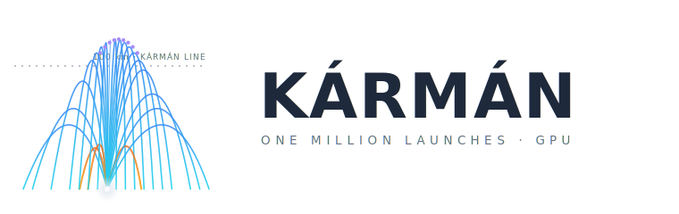

<p align="center">
  <picture>
    <source media="(prefers-color-scheme: dark)" srcset="assets/logo-dark.svg">
    
  </picture>
</p>

<p align="center">
  <strong><a href="https://wuisabel-gif.github.io/karmen/">Live site</a></strong> ·
  <a href="#why--dispersion-analysis">Dispersion analysis</a> ·
  <a href="#run">Run it</a>
</p>

Simulate **1,000,000 rocket launches in parallel** on the GPU using
[Slang](https://shader-slang.org/). Every GPU thread flies one rocket — its own
motor scatter, fuel, drag, wind, launch angle — and integrates the full
trajectory. No pixels are drawn; the GPU is used as a parallel physics computer.

```
GPU Thread 0        Rocket #0
GPU Thread 1        Rocket #1
...
GPU Thread 999999   Rocket #999999
```

## Why — dispersion analysis

A rocket never flies exactly as designed: motor thrust varies batch to batch,
fuel load and drag differ, wind shifts, and the launch angle is a hair off. Any
one simulation tells you what happens for *one* set of those values. Kármán runs
a million slightly-different rockets — a **Monte Carlo** sweep — and answers the
questions that actually matter for a launch:

- **Will it reach the target?** — e.g. *"84% of flights cross the 100 km Kármán line."*
- **How far will it land?** — downrange landing scatter (mean and 95th percentile), which sizes the recovery / safety zone.
- **How risky is it?** — probability of structural failure (g-load) and of parachute failure.
- **What's the spread?** — apogee percentiles (P5 / P50 / P95), not just an average.

This is the standard dispersion analysis that flight-dynamics tools run for
launch safety and hardware sizing; see Ceotto et al., *RocketPy: Six
Degree-of-Freedom Rocket Trajectory Simulator*, Journal of Aerospace Engineering
34(6), 2021, [doi:10.1061/(ASCE)AS.1943-5525.0001331](https://ascelibrary.org/doi/10.1061/%28ASCE%29AS.1943-5525.0001331),
and Miedziński, Głębocki & Jacewicz, *Analysis of Sounding Rocket Dispersion
Using Monte-Carlo Simulation* (Springer, 2023),
[doi:10.1007/978-3-031-25844-2_4](https://link.springer.com/chapter/10.1007/978-3-031-25844-2_4).
Kármán's angle is doing it *massively in parallel* — a million trajectories at
once — by treating a graphics shader language (Slang) as a scientific compute
engine.

## Run

```bash
pip install slangpy numpy
python src/main.py spaceshot          # or falcon, student
python src/main.py falcon --count 250000
python src/main.py student --engine cpu
```

Outputs land in `output/`: `report.txt`, `flights.csv` (per-rocket sample),
`histogram.csv` (apogee distribution).

## Real motors

Instead of a made-up constant thrust, feed a real motor's **RASP `.eng`**
thrust curve — the universal format used by OpenRocket, RockSim and
[thrustcurve.org](https://www.thrustcurve.org/), where thousands of real
AeroTech / Cesaroni / Estes motors are free to download:

```bash
python src/main.py spaceshot --motor motors/YourMotor.eng
```

Thrust and mass then follow the motor's actual impulse curve. (`motors/demo.eng`
is a **synthetic** placeholder so the pipeline runs out of the box — swap in a
real file.)

## What drives the spread

The report ends with a **sensitivity breakdown** — a first-order variance share
of how much each input uncertainty drives the dispersion. It turns a million
runs into a design decision:

```
WHAT DRIVES THE SPREAD (first-order variance share)
  apogee:      drag 63 %   motor 37 %      → control finish/Cd before motor lot
  downrange:   angle 90 %  drag 7 %        → landing scatter is all launch angle
```

## Validation

The physics is checked against closed-form answers, so the numbers can be
trusted rather than eyeballed — run the engine directly:

```bash
python src/reference.py     # ballistic apogee & terminal velocity vs analytic
```

Both match to <0.1 %.

## Scope & limitations

Kármán is a fast **screening / what-if** tool, not a certified range-safety
model. It's a **2-D point-mass** simulation (no pitch/yaw/roll, no weathercocking
or thrust misalignment) with a simplified wind profile and an empirical g-load
failure model. Absolute apogees depend on your inputs; the *relative* answers —
which tolerance dominates the spread, how the distribution shifts when you change
a parameter — are robust and are what it's for. For flight-qualified 6-DOF
analysis, use [RocketPy](https://github.com/RocketPy-Team/RocketPy) or OpenRocket.

## GPU vs CPU

`--engine auto` (default) runs the Slang kernel on the first available GPU
backend (Metal / D3D12 / CUDA / Vulkan). If none can dispatch, it falls back to
a vectorized **numpy** engine that runs the same physics on the CPU — so the
project runs anywhere, just slower and at a reduced count.

> **macOS note:** Metal compute through slangpy needs the full Metal toolchain,
> which ships with **Xcode** (`xcode-select --install` gives only Command Line
> Tools, which is not enough). Without Xcode the run uses the CPU fallback.

`src/reference.py` is that CPU engine and doubles as the correctness oracle —
run it directly for a self-check:

```bash
python src/reference.py     # asserts a nominal spaceshot behaves sanely
```

## Files

| File | Role |
|------|------|
| `src/simulate.slang` | the flight loop — one full trajectory per thread |
| `src/rocket.slang` | `Rocket` (input) and `Result` (output) structs |
| `src/atmosphere.slang` | `density()` and `gravity()` vs altitude |
| `src/wind.slang` | altitude-dependent horizontal wind |
| `src/montecarlo.slang` | per-rocket parameter scatter |
| `src/random.slang` | per-thread PCG RNG |
| `src/main.py` | load config → dispatch → statistics + sensitivity → report |
| `src/reference.py` | numpy engine: real answers, CPU fallback, analytic validation |
| `src/motor.py` | RASP `.eng` thrust-curve parser |
| `configs/*.json` | nominal rocket definitions |
| `motors/*.eng` | motor thrust curves (drop real ones from thrustcurve.org) |

## Physics

2D point mass (downrange × altitude). Semi-implicit Euler at 50 ms steps.
Thrust along the launch axis during burn; drag against air-relative velocity
(wind is horizontal) with a **transonic drag rise** near Mach 1; inverse-square
gravity; exponential atmosphere. A rocket **explodes** if the motor g-load
(thrust/mass) exceeds its airframe limit, and deploys a parachute at apogee —
which fails to open with a per-rocket probability.

The report gives full **dispersion statistics** — apogee percentiles (P5/P50/P95)
and horizontal **landing dispersion** (mean and 95th-percentile downrange) — the
standard outputs of a Monte Carlo trajectory study.

The tunable knobs (`maxAccel`, `chuteFailProb`, motor scatter) live in the
config files; adjust them to move the failure and 100-km-crossing rates.

## Why Slang

A compute shader is a parallel programming language, not just a shader. Kármán
uses a graphics-oriented language for aerospace Monte Carlo: numerical ODE
integration across a million independent trajectories, then data analysis
instead of rendering.
